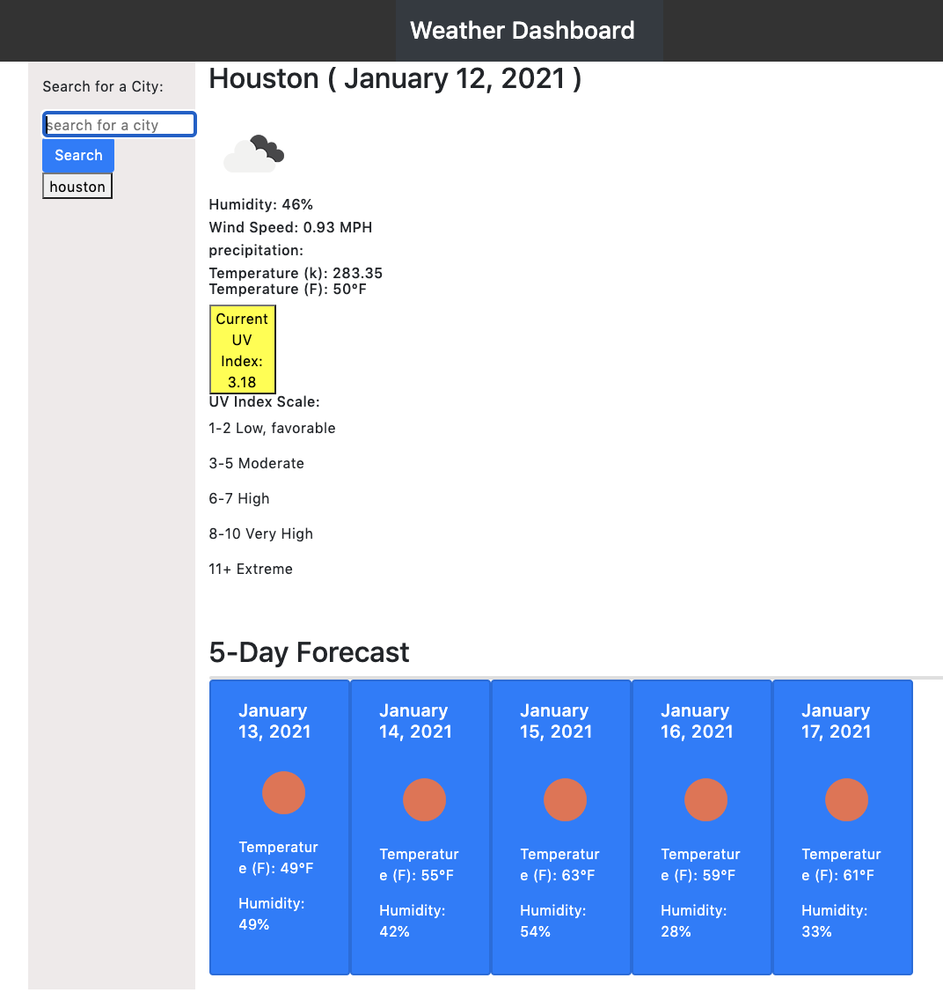

# 06 Server-Side APIs: Weather Dashboard

I used Open Weather API to create a dynamic weather website. Using the API allowed me to access the data and functionality by making requests with specific parameters to a URL. The website gives current weather temperature, the humidity, the wind speed, UV index, date, and icon representation of current weather conditions. A five day forecast displays the date, an icon representation of weather conditions, the temperature, and the humidity.

I want to thank my classmates Iyana and Will for helping me on this app as well as my tutor.

Resources used are [OpenWeather API](https://openweathermap.org/api), bootstrap, W3 Schools, and Stackoverflow

## Demo

The following image demonstrates the application functionality:

 

## Review

https://github.com/erumd/Weather-Dashboard

https://erumd.github.io/Weather-Dashboard/

